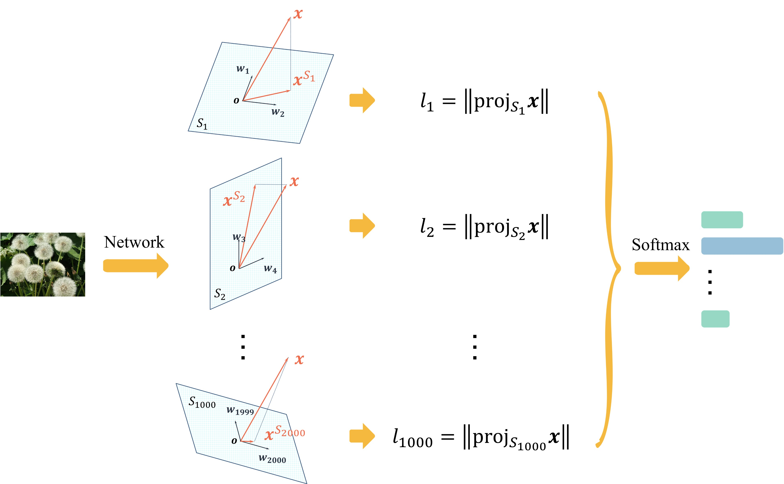

# Grassmann Class Representation

[](https://arxiv.org/pdf/2308.01547)
[](./resource/gcr-iccv2023-poster.pdf)

Official code for "Get the Best of Both Worlds: Improving Accuracy and Transferability by Grassmann Class Representation (ICCV 2023)"



## Installation

Run

```bash
python setup.py develop
```

### Requirements

- pytorch >= 1.13
- mmpretrain

### Prepare data

Put ImageNet-1K dataset on `data/imagenet` folder

## Training

```bash
# train ResNet50d baseline with 8 gpus
./tools/dist_train.sh configs/resnet/resnet50d_8xb32-coslr_in1k.py 8

# train the gcr version
./tools/dist_train.sh configs/resnet/resnet50d_8xb32-coslr_in1k_gcr8.py 8
```

## Citation

```
@inproceedings{haoqi2023gcr,
title = {Get the Best of Both Worlds: Improving Accuracy and Transferability by Grassmann Class Representation},
author = {Wang, Haoqi and Li, Zhizhong and Zhang, Wayne},
booktitle = {Proceedings of the IEEE/CVF International Conference on Computer Vision (ICCV)},
year = {2023}
}
```


## Related Projects

[ViM: Out-Of-Distribution with Virtual-logit Matching (CVPR 2022)](https://github.com/haoqiwang/vim)
